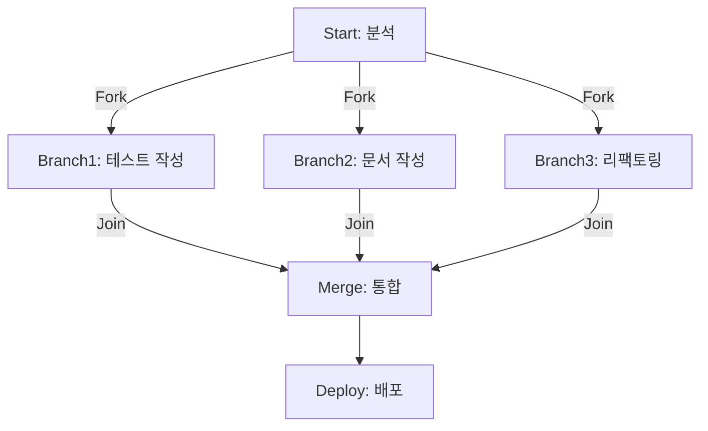
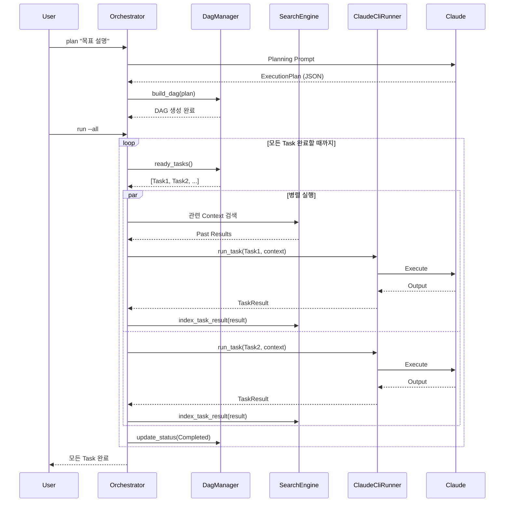

# Ouroboros 아키텍처

> LLM Agent Orchestration System의 핵심 아키텍처 문서

## 목차

- [개요](#개요)
- [DAG 기반 Task 의존성 관리](#dag-기반-task-의존성-관리)
- [Search 시스템](#search-시스템)
- [시스템 구성 요소](#시스템-구성-요소)
- [데이터 흐름](#데이터-흐름)

---

## 개요

Ouroboros는 복잡한 목표를 Task 단위로 분해하고, 의존성 그래프를 통해 실행 순서를 관리하며, 검색 시스템을 활용하여 과거 지식을 재활용하는 LLM Agent Orchestration System입니다.

### 핵심 설계 원칙

1. **DAG 기반 의존성 관리**: Task 간 관계를 방향성 비순환 그래프로 표현하여 순환 의존성 방지
2. **다국어 검색 지원**: BM25 + 한국어 형태소 분석으로 정확한 문서 검색
3. **병렬 실행 최적화**: Fork/Join 패턴을 통한 효율적인 Task 실행
4. **Knowledge Reuse**: 검색 기반 Context 재활용으로 중복 작업 방지

---

## DAG 기반 Task 의존성 관리

### 개념

Ouroboros는 **Directed Acyclic Graph (DAG)**를 사용하여 Task 간 의존성을 표현합니다. DAG의 각 노드는 Task를 나타내며, 엣지는 Task 간의 관계를 정의합니다.

```
            ┌────────────────┐
            │  Task A        │
            │  (분석)         │
            └────────┬───────┘
                     │
         ┌───────────┴───────────┐
         │                       │
         ▼                       ▼
  ┌──────────────┐      ┌──────────────┐
  │  Task B      │      │  Task C      │
  │  (테스트)     │      │  (문서화)     │
  └──────┬───────┘      └──────┬───────┘
         │                     │
         └───────────┬─────────┘
                     │
                     ▼
            ┌────────────────┐
            │  Task D        │
            │  (통합)         │
            └────────────────┘
```

### 핵심 구현: `DagManager`

위치: `src/dag/manager.rs`

#### 주요 자료구조

```rust
pub struct DagManager {
    graph: DiGraph<String, EdgeType>,     // petgraph 기반 DAG
    tasks: HashMap<String, Task>,         // Task 저장소
    indices: HashMap<String, NodeIndex>,  // ID → NodeIndex 매핑
}

pub enum EdgeType {
    Dependency,  // 순차 의존성: A 완료 → B 시작
    Fork,        // 병렬 분기: A 완료 → B, C 동시 시작
}
```

#### 순환 의존성 방지 메커니즘

1. **DAG 구조 강제**: `petgraph::graph::DiGraph` 사용
2. **위상 정렬 검증**: `toposort()` 함수로 순환 탐지
3. **엣지 추가 시 검증**: 추가 전 순환 발생 여부 확인

```rust
pub fn execution_order(&self) -> Result<Vec<String>> {
    let sorted = toposort(&self.graph, None)
        .map_err(|_| anyhow!("Cycle detected in task graph"))?;

    Ok(sorted.into_iter()
        .filter_map(|idx| self.graph.node_weight(idx).cloned())
        .collect())
}
```

**순환 의존성이 감지되면 즉시 에러 반환**하여 실행을 차단합니다.

### Task 상태 관리

```rust
pub enum TaskStatus {
    Pending,      // 대기 중 (의존성 미완료)
    InProgress,   // 실행 중
    Completed,    // 완료
    Failed,       // 실패
}
```

Task는 다음 조건에서만 실행 가능합니다:
- 상태가 `Pending`
- 모든 선행 의존성(Incoming edges)이 `Completed` 상태

```rust
pub fn ready_tasks(&self) -> Vec<&Task> {
    self.tasks.values()
        .filter(|task| {
            if !task.is_pending() {
                return false;
            }

            // 모든 의존성이 완료되었는지 확인
            let deps_completed = self.graph
                .neighbors_directed(idx, Direction::Incoming)
                .all(|dep_idx| {
                    self.tasks.get(dep_id)
                        .map(|t| t.is_completed())
                        .unwrap_or(false)
                });
            deps_completed
        })
        .collect()
}
```

### 병렬 실행: Fork/Join 패턴

#### Fork: 병렬 분기

하나의 Task 완료 후 여러 Task를 **동시 실행**:

```rust
// Task A 완료 → Task B, C, D 동시 시작
dag.fork("task-a", &["task-b", "task-c", "task-d"])?;
```

**Fork 엣지**는 `EdgeType::Fork`로 표시되어 병렬 실행 가능함을 명시합니다.

#### Join: 동기화 지점

여러 Task 완료 후 하나의 Task 시작:

```rust
// Task B, C, D 모두 완료 → Task E 시작
dag.join(&["task-b", "task-c", "task-d"], "task-e")?;
```

Join은 내부적으로 여러 `Dependency` 엣지로 구현됩니다.

#### Fork/Join 조합 예시



코드:
```rust
dag.fork("start", &["branch1", "branch2", "branch3"])?;
dag.join(&["branch1", "branch2", "branch3"], "merge")?;
dag.add_dependency("deploy", "merge")?;
```

**병렬 실행 식별 알고리즘**:

1. `fork_points()`: Fork 엣지를 가진 Task 탐색
2. `parallel_branches()`: Fork Task로부터 나가는 모든 Fork 엣지의 타겟 추출
3. `ready_tasks()`: 의존성이 모두 완료된 Task 목록 반환 → 이들은 병렬 실행 가능

### ExecutionPlan: 실행 계획 직렬화

위치: `src/dag/plan.rs`

Planning Agent가 생성한 실행 계획을 구조화된 형식으로 저장:

```rust
pub struct ExecutionPlan {
    pub workflow: WorkflowSpec,           // Task DAG 명세
    pub context_design: ContextDesign,    // Context 설계
}

pub struct WorkflowSpec {
    pub tasks: Vec<TaskSpec>,
    pub edges: Vec<EdgeSpec>,
}
```

**Plan Builder**로 프로그래매틱하게 생성 가능:

```rust
let plan = PlanBuilder::new()
    .task("analyze", "코드 분석", "코드베이스 구조 분석")
    .task("test", "테스트 작성", "단위 테스트 작성")
    .task("doc", "문서 작성", "API 문서 작성")
    .fork("analyze", &[("test", vec![]), ("doc", vec![])], vec![])
    .task("merge", "통합", "모든 결과 통합")
    .join(&["test", "doc"], "merge")
    .build()?;
```

**Plan 검증**:
- Task ID 유효성 검증
- Fork 설정과 Fork 엣지 일치성 검증
- 순환 참조 검증

---

## Search 시스템

### 개요

Ouroboros는 **Keyword Search (BM25)** 와 **Vector Search (Embedding)** 를 결합한 Hybrid Search 시스템을 제공합니다. 한국어 형태소 분석을 통해 다국어 검색 정확도를 높입니다.

### 아키텍처

```
┌──────────────────────────────────────────────┐
│          SearchEngine (Unified API)          │
├──────────────────────────────────────────────┤
│  Mode: KeywordOnly | VectorOnly | Hybrid     │
└───────────┬─────────────────────┬────────────┘
            │                     │
            ▼                     ▼
  ┌─────────────────┐   ┌─────────────────┐
  │ KeywordSearch   │   │ HybridSearch    │
  │  (Tantivy)      │   │ (Tantivy+Lance) │
  └────────┬────────┘   └────────┬────────┘
           │                     │
           ▼                     ▼
    ┌──────────────┐      ┌────────────┐
    │  BM25 Index  │      │ Vector DB  │
    │  (Tantivy)   │      │ (LanceDB)  │
    └──────────────┘      └────────────┘
```

### Keyword Search: BM25 알고리즘

위치: `src/search/keyword.rs`

#### BM25란?

**BM25 (Best Matching 25)**는 정보 검색에서 가장 널리 사용되는 확률적 랭킹 함수입니다.

**스코어 계산 공식**:

```
Score(D, Q) = Σ IDF(qᵢ) · (f(qᵢ, D) · (k₁ + 1)) / (f(qᵢ, D) + k₁ · (1 - b + b · |D| / avgdl))
```

- `D`: 문서 (Document)
- `Q`: 쿼리 (Query)
- `qᵢ`: 쿼리의 i번째 단어
- `f(qᵢ, D)`: 문서 D에서 단어 qᵢ의 출현 빈도
- `|D|`: 문서 길이
- `avgdl`: 평균 문서 길이
- `IDF(qᵢ)`: 역문서 빈도 (Inverse Document Frequency)
- `k₁`, `b`: 조정 파라미터 (기본값: k₁=1.2, b=0.75)

**특징**:
- **Term Frequency 포화**: 단어가 너무 많이 등장해도 점수가 무한정 증가하지 않음
- **문서 길이 정규화**: 긴 문서가 불리하지 않도록 조정
- **희귀 단어 강조**: IDF로 흔한 단어는 낮은 가중치, 희귀한 단어는 높은 가중치

#### Tantivy 통합

Tantivy는 Rust로 작성된 고성능 전문 검색 엔진 라이브러리로, Lucene과 유사한 아키텍처를 가집니다.

```rust
pub struct KeywordSearch {
    index: Index,               // Tantivy 인덱스
    reader: IndexReader,        // 검색용 Reader
    writer: Option<IndexWriter>, // 색인용 Writer (read-write 모드만)
    // Field 핸들
    title_field: Field,
    content_field: Field,
    // ...
}
```

**검색 프로세스**:

```rust
pub fn search(&self, query: &str, options: &SearchOptions)
    -> Result<Vec<SearchResult>>
{
    let searcher = self.reader.searcher();

    // 1. Query Parser로 쿼리 파싱
    let query_parser = QueryParser::for_index(
        &self.index,
        vec![self.title_field, self.content_field]
    );
    let parsed_query = query_parser.parse_query(query)?;

    // 2. BM25로 Top-K 검색
    let top_docs = searcher.search(
        &parsed_query,
        &TopDocs::with_limit(options.limit)
    )?;

    // 3. 결과 정규화 및 필터링
    for (score, doc_address) in top_docs {
        let normalized_score = 1.0 / (1.0 + (-score).exp());
        // 최소 점수 필터링
        if normalized_score >= options.min_score {
            results.push(SearchResult { ... });
        }
    }
}
```

### 한국어 형태소 분석

#### 왜 필요한가?

한국어는 교착어로, 단어가 어근 + 접사로 결합됩니다. 형태소 분석 없이는:
- "검색하다", "검색했다", "검색하고" → 각각 다른 단어로 인식
- "데이터베이스", "데이터-베이스" → 매칭 실패

형태소 분석을 통해 **어근을 추출**하여 검색 정확도를 높입니다.

#### Lindera + KoDic 통합

**Lindera**는 Rust 기반 형태소 분석 라이브러리로, 다양한 언어 사전을 지원합니다.
**KoDic**는 한국어 형태소 분석용 사전입니다.

```rust
fn register_korean_tokenizer(index: &Index) -> Result<()> {
    // 1. KoDic 사전 로드
    let dictionary = load_embedded_dictionary(DictionaryKind::KoDic)?;

    // 2. Segmenter 생성 (형태소 분석기)
    let segmenter = Segmenter::new(Mode::Normal, dictionary, None);

    // 3. Tantivy Tokenizer로 변환
    let lindera_tokenizer = LinderaTokenizer::from_segmenter(segmenter);

    // 4. LowerCaser 필터 추가 (소문자 변환)
    let text_analyzer = TextAnalyzer::builder(lindera_tokenizer)
        .filter(LowerCaser)
        .build();

    // 5. Tokenizer 등록
    index.tokenizers().register("korean", text_analyzer);

    Ok(())
}
```

**Analyzer 파이프라인**:

```
입력 텍스트
   ↓
[Lindera Tokenizer]
   ↓
형태소 토큰
   ↓
[LowerCaser Filter]
   ↓
정규화된 토큰
   ↓
인덱싱/검색
```

**예시**:

입력: "데이터베이스를 검색하고 있습니다"

Tokenizer 출력:
```
["데이터베이스", "를", "검색", "하", "고", "있", "습니다"]
```

LowerCaser 적용 후:
```
["데이터베이스", "를", "검색", "하", "고", "있", "습니다"]
```

주요 형태소 추출:
```
["데이터베이스", "검색"]
```

→ "검색했다", "검색하기" 등도 동일한 어근 "검색"으로 매칭 가능

#### 스키마 정의

```rust
let text_options = TextOptions::default()
    .set_indexing_options(
        TextFieldIndexing::default()
            .set_tokenizer("korean")  // 한국어 tokenizer 지정
            .set_index_option(
                tantivy::schema::IndexRecordOption::WithFreqsAndPositions
            )
    )
    .set_stored();

let title_field = schema_builder.add_text_field("title", text_options.clone());
let content_field = schema_builder.add_text_field("content", text_options);
```

**IndexRecordOption::WithFreqsAndPositions**:
- **Freqs**: Term Frequency 저장 (BM25 계산용)
- **Positions**: 단어 위치 저장 (구문 검색, 근접도 검색 지원)

### 검색 정확도 향상 기법

#### 1. Multi-field Search

Title과 Content를 동시에 검색하여 관련성 높은 문서 발견:

```rust
let query_parser = QueryParser::for_index(
    &self.index,
    vec![self.title_field, self.content_field]
);
```

#### 2. Score 정규화

BM25 점수는 unbounded이므로 sigmoid로 0~1 범위로 정규화:

```rust
let normalized_score = 1.0 / (1.0 + (-score).exp());
```

#### 3. 필터링

Document Type, Session ID, 최소 점수 기준으로 결과 필터링:

```rust
if let Some(filter_type) = &options.doc_type {
    if doc_type != *filter_type {
        continue;
    }
}
if normalized_score < options.min_score {
    continue;
}
```

### Document Type

Ouroboros는 다양한 문서 타입을 검색 가능:

```rust
pub enum DocumentType {
    Task,              // Task 정의
    TaskResult,        // Task 실행 결과
    Context,           // Context 문서
    Plan,              // Execution Plan
    ValidationReport,  // 검증 보고서
    Knowledge,         // Knowledge Entry
}
```

각 타입별로 필터링하여 특정 문서만 검색 가능:

```rust
let options = SearchOptions::new()
    .with_doc_type(DocumentType::Task)
    .with_limit(5);

let results = search_engine.search("API 설계", &options).await?;
```

### Reader/Writer 모드

**문제**: 여러 프로세스가 동시에 쓰기를 시도하면 Lock Conflict 발생

**해결책**: Reader-only 모드 제공

```rust
// Write 모드: 색인 + 검색
let mut search = KeywordSearch::new(index_path)?;
search.index_document(&doc)?;
search.commit()?;

// Read-only 모드: 검색만 (Lock 없음)
let search = KeywordSearch::new_reader_only(index_path)?;
let results = search.search(query, &options)?;
```

### Hybrid Search (확장)

위치: `src/search/hybrid.rs`

Keyword Search와 Vector Search를 결합:

```rust
pub async fn search(
    &self,
    query: &str,
    query_embedding: Vec<f32>,
    options: &SearchOptions,
) -> Result<Vec<SearchResult>> {
    // 1. Vector Search
    let vector_results = self.vector_search()
        .search(query_embedding, options).await?;

    // 2. Keyword Search
    let keyword_results = self.keyword_search()
        .search(query, options)?;

    // 3. Reciprocal Rank Fusion (RRF)으로 결과 융합
    let merged = self.merge_results(
        vector_results,
        keyword_results,
        self.config.keyword_weight
    );

    Ok(merged)
}
```

**RRF (Reciprocal Rank Fusion)** 알고리즘:
```
RRF_score(d) = Σ 1 / (k + rank_i(d))
```

- Vector와 Keyword 결과를 순위 기반으로 결합
- k=60 (기본값)
- 각 검색 방법의 편향을 줄이고 다양성 확보

---

## 시스템 구성 요소

### 1. Orchestrator

위치: `src/orchestrator.rs`

전체 시스템의 조정자 역할:

```rust
pub struct Orchestrator {
    dag: DagManager,
    context_tree: ContextTree,
    search_engine: Option<SearchEngine>,
    cli_runner: ClaudeCliRunner,
}
```

**주요 책임**:
- Task 실행 스케줄링
- Context 조립
- 검색 시스템 통합
- Claude CLI 호출 관리

### 2. ClaudeCliRunner

위치: `src/cli/runner.rs`

Claude Code CLI와의 인터페이스:

```rust
pub async fn run_task(
    &self,
    task: &Task,
    context: &str,
    model: ClaudeModel,
) -> Result<TaskResult> {
    let session_file = self.ensure_session(&task.id)?;

    let prompt = self.build_prompt(task, context);

    // claude --print --resume <session_file> <prompt>
    let output = self.execute_cli(
        &["--print", "--resume", session_file, &prompt],
        model,
    ).await?;

    Ok(TaskResult::from_output(task, output))
}
```

### 3. ContextTree

위치: `src/dag/context.rs`

Fork/Join 시 Context를 계층적으로 관리:

```
Root Context
  ├─ Task A Result
  ├─ Shared Context (Fork 전 캐시)
  │
  ├─ Branch 1 Context (Shared + Local)
  │   └─ Task B Result
  │
  ├─ Branch 2 Context (Shared + Local)
  │   └─ Task C Result
  │
  └─ Merge Context (Branch 1 + Branch 2)
      └─ Task D Input
```

### 4. WorkSession

위치: `src/work_session.rs`

단일 작업 세션 관리:

```rust
pub struct WorkSession {
    pub id: String,
    pub goal: String,
    pub created_at: DateTime<Utc>,
    pub status: SessionStatus,
}
```

---

## 데이터 흐름

### 1. 전체 흐름도



### 2. Fork/Join 데이터 흐름

```
┌─────────────────────────────────────────────────────────┐
│  Task A 완료                                             │
│  Output: analysis_result.md                             │
└───────────────────────┬─────────────────────────────────┘
                        │
                        ▼
          ┌─────────────────────────────┐
          │  ContextTree.cache_shared() │
          │  - analysis_result.md       │
          │  - previous_outputs.md      │
          └──────────────┬──────────────┘
                         │
        ┌────────────────┼────────────────┐
        │                │                │
        ▼                ▼                ▼
   ┌────────┐       ┌────────┐       ┌────────┐
   │Task B  │       │Task C  │       │Task D  │
   │(병렬)   │       │(병렬)   │       │(병렬)   │
   └───┬────┘       └───┬────┘       └───┬────┘
       │                │                │
       │                │                │
       └────────────────┼────────────────┘
                        │
                        ▼
              ┌─────────────────┐
              │  Context.merge()│
              │  - B 결과        │
              │  - C 결과        │
              │  - D 결과        │
              └────────┬────────┘
                       │
                       ▼
                  ┌────────┐
                  │Task E  │
                  │(Join)  │
                  └────────┘
```

**캐시 메커니즘**:
1. Fork 직전: Shared Context를 `ContextTree`에 캐시
2. Branch 실행: Shared Context + 각 Branch의 Local Context
3. Join: 모든 Branch 결과를 병합하여 새로운 Context 생성

### 3. 검색 기반 Context 재활용

```
┌──────────────────────────────────────┐
│  새로운 Task 시작                     │
│  "API 엔드포인트 설계"                │
└─────────────┬────────────────────────┘
              │
              ▼
      ┌────────────────┐
      │  SearchEngine  │
      │  query: "API"  │
      └───────┬────────┘
              │
              ▼
  ┌──────────────────────────┐
  │  BM25 Search             │
  │  - 과거 API 관련 Task    │
  │  - 관련 TaskResult       │
  │  - Knowledge Entry       │
  └──────────┬───────────────┘
             │
             ▼
   ┌──────────────────────┐
   │  Top-5 Results       │
   │  - task-042: API 설계│
   │  - task-089: REST API│
   │  - knowledge-12: ...  │
   └──────────┬───────────┘
              │
              ▼
      ┌────────────────┐
      │  Assemble      │
      │  Context       │
      └───────┬────────┘
              │
              ▼
   ┌────────────────────────┐
   │  Claude CLI 실행        │
   │  Context: 재활용된 지식  │
   └────────────────────────┘
```

**이점**:
- 과거 작업 재활용으로 중복 방지
- 일관성 있는 설계 유지
- 학습 효과 (과거 실수 반복 방지)

---

## 성능 최적화

### 1. DAG 최적화

- **O(V + E) 위상 정렬**: 선형 시간 복잡도
- **Lazy Evaluation**: ready_tasks()는 필요할 때만 계산
- **HashMap 기반 인덱싱**: O(1) Task 조회

### 2. 검색 최적화

- **Tantivy의 Inverted Index**: O(log N) 검색 성능
- **MmapDirectory**: OS의 메모리 매핑 활용으로 I/O 최소화
- **Reader 재활용**: ReloadPolicy로 불필요한 재오픈 방지

```rust
let reader = index
    .reader_builder()
    .reload_policy(ReloadPolicy::OnCommitWithDelay)
    .try_into()?;
```

### 3. 병렬 실행

- **Tokio 비동기**: `tokio::spawn`으로 Task 병렬 실행
- **Fork 감지 자동화**: `fork_points()`로 병렬 가능 Task 식별
- **Context 캐싱**: 중복 Context 로드 방지

---

## 확장성

### 1. DAG 확장

- **중첩 DAG**: Sub-DAG를 노드로 가지는 메타 DAG 지원 가능
- **Dynamic Task**: 실행 중 Task 동적 추가 가능 (향후)
- **Conditional Edge**: 조건부 의존성 (향후)

### 2. 검색 확장

- **Vector Search 통합**: Hybrid Search로 의미 기반 검색 강화
- **Re-ranking**: BERT 기반 Cross-Encoder로 재순위화
- **Query Expansion**: 동의어, 유의어 확장으로 Recall 향상

### 3. 다국어 지원

현재 한국어 외 추가 지원 가능:
- **Japanese**: `DictionaryKind::IpaDic`
- **Chinese**: `DictionaryKind::CC-Cedict`
- **영어**: Tantivy 기본 Tokenizer 사용

---

## 기술 스택

| 계층              | 기술                        | 역할                          |
|-------------------|-----------------------------|-------------------------------|
| **DAG 관리**      | `petgraph`                  | 그래프 자료구조 및 알고리즘   |
| **검색 엔진**     | `tantivy`                   | BM25 기반 전문 검색           |
| **형태소 분석**   | `lindera` + `lindera-tantivy` | 한국어 토크나이저           |
| **Vector DB**     | `lancedb`                   | 임베딩 벡터 저장 (Hybrid용)   |
| **Embedding**     | `fastembed`                 | 텍스트 → 벡터 변환            |
| **비동기 런타임** | `tokio`                     | 병렬 Task 실행                |
| **직렬화**        | `serde`, `serde_json`, `serde_yaml` | 데이터 영속화      |
| **CLI**           | `clap`                      | 명령줄 인터페이스             |
| **로깅**          | `tracing`, `tracing-subscriber` | 구조화된 로깅          |

---

## 참고 자료

- [petgraph Documentation](https://docs.rs/petgraph/)
- [Tantivy Documentation](https://docs.rs/tantivy/)
- [BM25 Algorithm (Wikipedia)](https://en.wikipedia.org/wiki/Okapi_BM25)
- [Lindera - Korean Morphological Analyzer](https://github.com/lindera-morphology/lindera)
- [DAG (Directed Acyclic Graph)](https://en.wikipedia.org/wiki/Directed_acyclic_graph)

---

**Last Updated**: 2025-02-05
**Version**: 0.1.0
